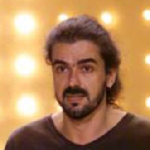
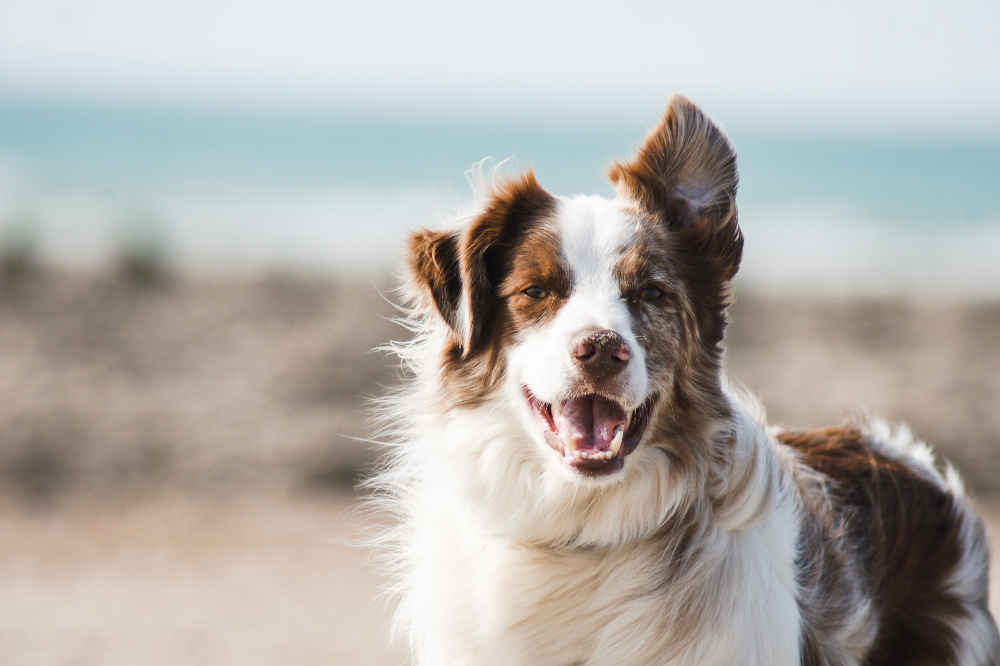
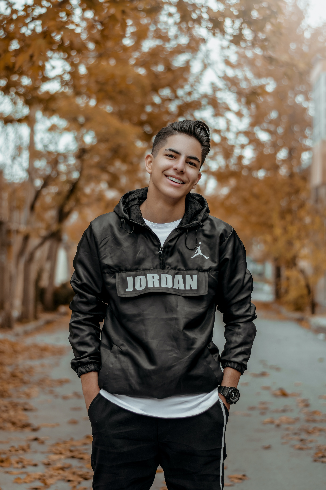
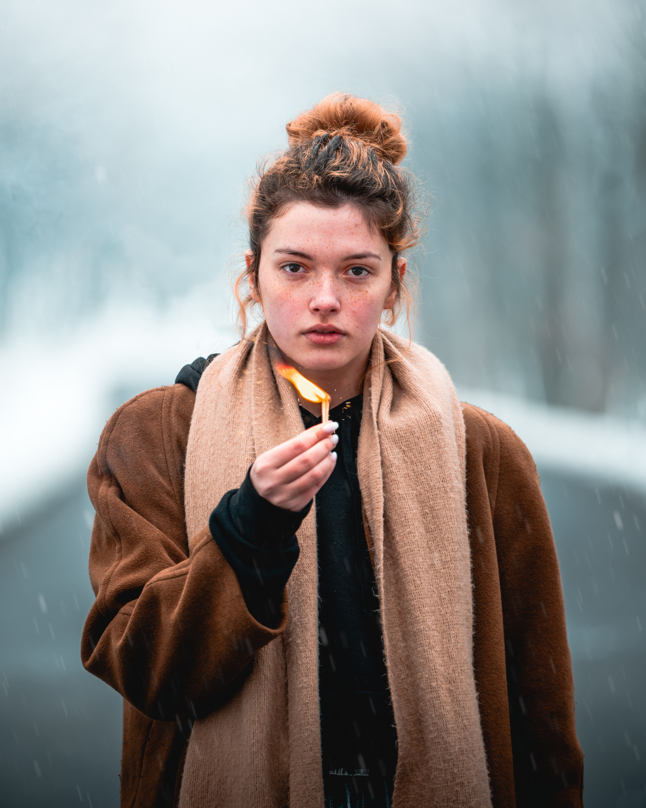

# Classifying Dog Breeds

[image0]: ../images/sample_images/Dog3.jpg "Dog"
[image1]: ../images/Brittany_02625.jpg "Example Dog"
[image2]: ../images/example_person.png "Example Person"
[image3]: ../images/classes.png "Class Numbers"
[image4]: ../images/face_detection.png "Face Detection"
[image5]: ../images/InceptionV3_training.png "Training"
[image6]: ../images/sample_images/Dog1.jpg "Dog 1"
[image7]: ../images/sample_images/Dog2.jpg "Dog 2"
[image8]: ../images/sample_images/Dog3.jpg "Dog 3"
[image9]: ../images/sample_images/Dog4.jpg "Dog 4"
[image10]: ../images/sample_images/Person1.jpg "Person 1"
[image11]: ../images/sample_images/Person2.jpg "Person 2"
[image12]: ../images/sample_images/Person3.jpg "Person 3"
[image13]: ../images/sample_images/Person4.jpg "Person 4"
[image14]: ../images/sample_images/Cat.png "Cat"

![Dog][image0]

## Project Overview
Advances in Computer Vision mean that computers can now perform image recognition and classification on real images wth little preprocessing. This project uses a Convolutional Neural Network (CNN) to classify dog breeds if presented with an image of a dog, or identifies which dog breed a person most resembles if presented with a clear image of a face.

The data used are provided by Udacity, under the [Data Science Nanodegree](https://www.udacity.com/course/data-scientist-nanodegree--nd025) final capstone project. These include:
* dog images, split into train, validation and test partitions, provided by Udacity
* human images data set, provided by Udacity
* [ImageNet](http://www.image-net.org/), a heierarchical image database consisting of hundreds of images for each class of thousands of classes, thus very popular for training Convolutional Neural Networks.

## Problem Statement
The goal is to build an algorithm that takes an image path, identifies whether a human or a dog is present, then classifies that image by dog breed. Three steps are required:
1) Determine if a human face is present
2) Determine if a dog is present
3) Classify the breed in the image

A separate classifier is required for each step, trained for the specific purpose, then must be combined for the overall app.

## Metrics
The model performance will be measured by calculating the accuracy on test data, which has been witheld from the training and validation process.

## Data Exploration
There are two data sets provided with this project, a set of dog images and a set of human images. Below are example images from this data set.

In total, there are 8351 dog images in 133 different breeds. 6680 are used for training, 835 for validation and 836 in the test set. There are 13233 human images to use to train the face detector.

   

Given that the purpose is to classify dog breeds, it is important to examine the classes of this data set. The bar chart below shows the number of images in each class. Blue is the larger training set and brown the smaller validation data.

![Class numbers][image3]

It is clear that some classes have more examples than others. The Alaskan Malamute has the highest number of training examples, so is expected to be predicted more often, if only because the model learns that this is a more likely class.

Conversely, the Norwegian Lundehund and the Xoloitzcuintli have the fewest examples, so are less likely to be predicted.

Other factors, such as similarities between classes, may result in higher predictions for these classes. Thus class imbalance is not the only consideration in expected performance.

There are relatively few examples in the test set, so a single missed detetion or false alarm will have a great impct on the performance measures.

## Methodology

### 1) Human Face Detector
A pretrained human face detector is used from [OpenCV's implementation of Haar feature-based cascade classifiers](https://docs.opencv.org/master/d7/d8b/tutorial_py_face_detection.html). This requires images to be converted to grayscale, which can also be achieved with the cv2 library. An example of face detection is shown below, using the bounding box returned by the Open CV function.

![Face detection][image4]

Face detection algorithms are a subject of active research, so there are many solutions available, which are always evolving.

[This post](https://rapidapi.com/blog/top-facial-recognition-apis/) compares a number of facial recognition APIs, many of which can detect additional features, such as age, gender and race.

The OpenCV face detection algorithm is chosen because it is fully integrated into Python and achieves reasonable results based on validation against test data. Since the detector is already trained, the human face data does not need to be split into train, test and validation sets.

### 2) Dog Detector
A pre-trained model is used to detect dogs in imagery, using the [ResNet-50 model](http://ethereon.github.io/netscope/#/gist/db945b393d40bfa26006) trained on [ImageNet](http://www.image-net.org/). 

#### Data Preprocessing
Data required preprocessing before it can be passed to the pre-trained model. The steps are:
1) Load image and convert to 3D tensor with dimensions 224 x 224 x 3. The first two dimensions are the spatial pixels of the image and the third is the number of chanels for a colour image.
2) Convert to 4D tensor. The model expects a 4D tensor, where the first dimension is the batch number. For single images, this is achieved with a shape of 1 x 224 x 224 x 3. 
3) The channels are then converted from RGB to BGR using Keras' preprocess_input function in the keras.applications.resnet50 library
4) The same preprocess_input function also normalises the images by subtracting the mean from every pixel in each image

#### Implementation
With the model and pre-trained weights loaded, only the predict function need be called to classify the images. This returns a class label, many of which are dog classes. Labels 268 to 11 of ImageNet are dog classes, so if any of these are returned, a dog is detected. A wrap around function tests these classes and returns True if one is present.

#### Refinement
Since the pre-trained model achieves high results, there is no need for refinement. However, if needed, this could be achieved by testing different models with different training data. Given that ImageNet contains many examples of dogs, the model is expected to perform well on dog detection.

### 3) Dog Breed Classifier

#### Data Preprocessing
Data are rescaled by dividing each pixel by the maximum value possible (255) before converting to 4D tensors, as with the dog detector.

#### Implementation - Training From Scratch
A CNN is used to classify the images with a detected dog or person. Initially, a CNN is trained from scratch using only the data provided, but this does not yeild high accuracy. A simple model architecture is used to avoid overfitting on the limited data:

_________________________________________________________________
Layer (type)                 Output Shape              Param #   
=================================================================
conv2d_1 (Conv2D)            (None, 222, 222, 32)      896       
_________________________________________________________________
max_pooling2d_2 (MaxPooling2 (None, 111, 111, 32)      0         
_________________________________________________________________
dropout_1 (Dropout)          (None, 111, 111, 32)      0         
_________________________________________________________________
conv2d_2 (Conv2D)            (None, 109, 109, 64)      18496     
_________________________________________________________________
max_pooling2d_3 (MaxPooling2 (None, 54, 54, 64)        0         
_________________________________________________________________
global_average_pooling2d_1 ( (None, 64)                0         
_________________________________________________________________
dense_1 (Dense)              (None, 133)               8645      
=================================================================
Total params: 28,037,
Trainable params: 28,037,
Non-trainable params: 0

A few different architectures were tried and the best selected based on the validation score. Two convoltional layers were found to achieve higher validation accuracy than three, in addition to training faster. Max pooling layers are used after each convolutional layer since these reduce the number of parameters needed to be learnt and abstract the information in the previous layer.

Dropout layers were added to help reduce overfitting and improve training of all network nodes.

For the first convolutional layer, 32 features were selected, increasing to 64 in the second convolutional layer. Given the large image size, more features are advantageous to capture more information. The dense layer requires 133 features since it must match the number of classes i.e. dog breeds.

ReLU activation functions are used to overcome the vanishing gradient problem and speed up training.

#### Refinement - Transfer Learning
To improve the classification performance, a pre-trained model is used, which has been trained on vast amounts of ImageNet data. Thus the untrained layers of the model only need to learn the differences between classes rather than how to extract lower level features such as lines and corners etc. Since ImageNet already has different classes of dog, this model is close to the application, so should yield good results.

Two different models are trained and compared: VGG16 and InceptionV3, using weights provided by Udacity.

InceptionV3 is selected because it is a more recent model with smaller sized weights, i.e. fewer parameters, compared to VGG19 and ResNet50 according to [this post](https://www.pyimagesearch.com/2017/03/20/imagenet-vggnet-resnet-inception-xception-keras/). They also achieve higher accuracy than ResNet50 in [this test](https://www.kaggle.com/gowrishankarin/resnet50-vs-inceptionv3-vs-xception-vs-nasnet). Unfortunately, the weights provided for Xception by Udacity were too large for the workspace provided, so could not be compared.

A single dense layer is added to classify the images into dog breeds for both models, since there are not a huge number of images compared to ImageNet and this avoids overfitting.

## Results

### 1) Human Face Detector
The human face detector was validated against 100 sample human images and 100 sample dog images. 100% of human images were detected with a face, but also 11% of dog images. This means that dog images could be classified as human an incorrectly treated by the application. In order to avoid this, the human face detctor could be applied after the dog detector.

It is not expected that an algorithm would achieve perfect performance on all images. In order to mitigate user frustration, advice can be provided to provide clear images of faces in the event the algorithm fails.

### 2) Dog Detector
The dog detector was also validated against the same 100 sample human images and 100 sample dog images. Of the human images, a dog was detected in 0%, whereas a dog was detected in 100% of the dog data set. Given the higher performance over the human classifier, this should be used before the human classifier. The improved performance is likely to be due to the vast data set and the ability of deep learning to generalise on unseen data.

### 3) Dog Breed Classifier
When trained from scratch the CNN achieves a classification accuracy of 1.1%.

When trained using the pre-trained VGG model, a classification accuracy of 42.1% is achieved.

When trained using the pre-trained InceptionV3 model, a classification accuracy of 78.3% is achieved. The performance throughout training is shown below, with no real increase in the validation accuracy for more than 20 epochs.

![Training][image5]

Thus InceptionV3 is more suitable for this task. This model likely performs better than VGG16 becasue of the differing arhitectures. InceptionV3 implements multi-level feature extraction, which uses different sized kernels for convlutional within the same layer, then concatenates the results.

### Dog Classification app

Examples of the final algorithm incorporating all of the tasks are shown below. These are obtained from Unsplash or private images.

Dog is a Dachshund  

Dog is an American eskimo dog  
 

Dog is a Border collie  
 

Dog is a Golden retriever  
 

Person resembles a Greyhound  
 

Person resembles a Greyhound  
 

Person resembles a Greyhound  
 

Person resembles a Dachshund  
 

No face detected. Please make sure face is clear or try another image.  
  
  
The algorithm correctly identifies dogs and people. No dog or person is incorrectly detected in the cat picture. Breeds resemble the labeled breed, but without knowledge of the actual breed it is difficult to accurately assess. The yellow labrador is classified as a golden labrador, which is very close, and the dashund is correctly classified. People are identified as a greyhound for 3 out of 4 images, despite few similarities. This could potentially be improved if more people are used in the pre-training.

The model would likely need more data to train to higher accuracy, especialy to distinguish between similar breeds.

There may also be mixed breeds, which could confuse the model.

## Reflection
The final algorithm can be summarised as:
1) Determine if a dog is present  
    1a) Preprocess by converting to 4D tensor, switching channels to BGR and normalising  
    1b) Feed into ResNet50 pretrained model to detect dog  
2) If a dog is not present, determine if a human face is present  
    2a) Convert image to greyscale  
    2b) Apply OpenCV's Haar feature-based cascade classifier to detect human face.  
3) If a dog or person is present, classify the breed in the image  
    3a) Rescale image and convert to 4D tensor  
    3b) Using model trained on data (pretrained Inception3), predict class  
4) Return message to user:  
    If dog: return breed  
    If person: return breed resembles  
    If neither: return error message  

Overall, this project was achieved by:
1) Identifying a relevant problem
2) Importing and analysing the data
3) Splitting the problem into separate problems
4) Considering existing implementations where appropriate
5) Testing suitability of existing implementations
6) Training the bespoke dog breed clssifier from scratch
7) Adapting to use transfer earning to improve the results
8) Experimenting with different architectures and parameters to tune models
9) Combining the best models into the final algorithm as detailed above
10) Testing on new data
11) Evaluating project and contemplating possible improvements

Unfortunately it was not possible to compare results from Xception due to the provided trained weights being larger than the workspace provided. Uploaded files took longer than training the models, which was a major frustration, but was still faster than training models from scatch.

There are many tasks that could be solved by this type of approach, but the main limiting factor is the training data. Labelled data are required for classification, and permission should be obtained. For this reason, I chose to use the provided data.

It was interesting to see how many different types of dog breed are included and how a computer can distinguish between these.

## Improvement

The app could best be improved by using more data in the breed classification step. This would require annotated images, which could involve considerable effort. Data augmentation may improve the performance without needing new data.

Another improvement could be to incorporate this into a deployed application, interfacing with a camera, so people could use it directly on their phone to classify dog breedsor themselves.
